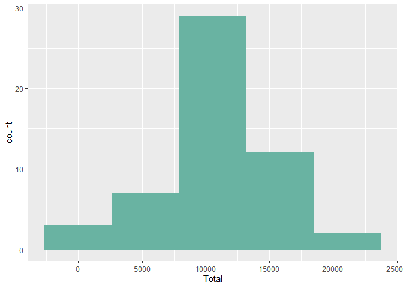
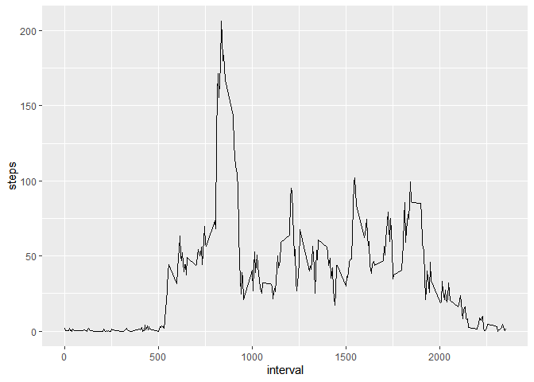
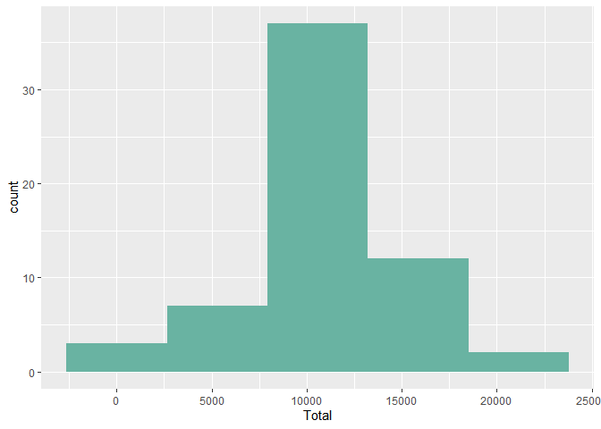
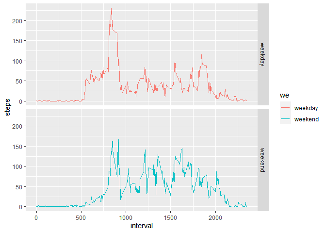

## Loading and preprocessing the data

1) First we unzip the dataset

```r
if(!file.exists("activity.zip")){
  unzip(zipfile = "activity.zip")
}
```

2) Then we load the data

```r
data <- read.csv("activity.csv")
```

3) Next we remove NA's from data

```r
datanna <- data[!is.na(data["steps"]),]
```

4) Let's take a look on data.

```r
head(datanna)
```

```
##     steps       date interval
## 289     0 2012-10-02        0
## 290     0 2012-10-02        5
## 291     0 2012-10-02       10
## 292     0 2012-10-02       15
## 293     0 2012-10-02       20
## 294     0 2012-10-02       25
```
## What is mean total number of steps taken per day?
1) First we calculate the total number of steps taken per day 

```r
library(dplyr)
totalstepsperday <- summarise(group_by(datanna, date), Total=sum(steps))
```

2) We plot (histogram) the total number of steps taken each day

```r
library(ggplot2)
p <- ggplot(totalstepsperday, aes(x=Total)) + geom_histogram(aes(y=..count..),bins = 5,fill="#69b3a2")
p
```

<!-- -->

3) Calculate and report the mean and median of the total number of steps taken per day

```r
mean(totalstepsperday$Total)
```

```
## [1] 10766.19
```

```r
median(totalstepsperday$Total)
```

```
## [1] 10765
```

## What is the average daily activity pattern?
1) Make a time series plot of the 5-minute interval (x-axis) and the average number of steps taken, averaged across all days (y-axis)

```r
avg_step <- aggregate(steps ~ interval, data = datanna, mean)
p <- ggplot(avg_step, aes(x=interval, y=steps)) +
     geom_line()
p
```

<!-- -->

2) Which 5-minute interval, on average across all the days in the dataset, contains the maximum number of steps?

```r
avg_step[which.max(avg_step$steps),]
```

```
##     interval    steps
## 104      835 206.1698
```

## Imputing missing values
1) Calculate and report the total number of missing values in the dataset (i.e. the total number of rows with NAs)

```r
nrow(data[is.na(data["steps"]),])
```

```
## [1] 2304
```

2) Filling in all of the missing values in the dataset. Using the mean/median for that day, or the mean for that 5-minute interval, etc. And create a new dataset that is equal to the original dataset but with the missing data filled in.

```r
newdata <- data
for (row in 1:nrow(data)) {
    if(is.na(data[row,"steps"])){
        newdata[row,"steps"] <- mean(data[data$interval == data[row,"interval"],"steps"],na.rm = TRUE)
    }
}
```

3) Histogram of the total number of steps taken each day

```r
totalstepsperday <- summarise(group_by(newdata, date), Total=sum(steps))
```

```
## `summarise()` ungrouping output (override with `.groups` argument)
```

```r
p <- ggplot(totalstepsperday, aes(x=Total)) + geom_histogram(aes(y=..count..),bins = 5,fill="#69b3a2")
p
```

<!-- -->

4) Calculate and report the mean and median total number of steps taken per day.

```r
mean(totalstepsperday$Total)
```

```
## [1] 10766.19
```

```r
median(totalstepsperday$Total)
```

```
## [1] 10766.19
```

5) Do these values differ from the estimates from the first part of the assignment? What is the impact of imputing missing data on the estimates of the total daily number of steps?

As we note the mean and the median not change because of the new values.


## Are there differences in activity patterns between weekdays and weekends?
1) First we create a new factor variable in the dataset with two levels – “weekday” and “weekend” indicating whether a given date is a weekday or weekend day.

```r
newdata <- mutate(newdata,wd = weekdays(as.Date(newdata$date))) 
newdata$we = ifelse(newdata$wd %in% c("sábado", "domingo"), "weekend", "weekday")
```

2) Then we make a panel plot containing a time series plot of the 5-minute interval (x-axis) and the average number of steps taken, averaged across all weekday days or weekend days (y-axis).

```r
avg_step <- aggregate(steps ~ interval+we, data = newdata, mean)
ggplot(avg_step, aes(x=interval, y=steps)) +
  geom_line(stat = "identity", aes(colour = we)) +
  facet_grid(we~.)
```

<!-- -->

Answering the question we can see some subtle differences between the average number of steps between weekdays and weekends. For instance, it appears that the user started a bit later on weekend mornings and tend to do smaller numbers on weekend mornings.
